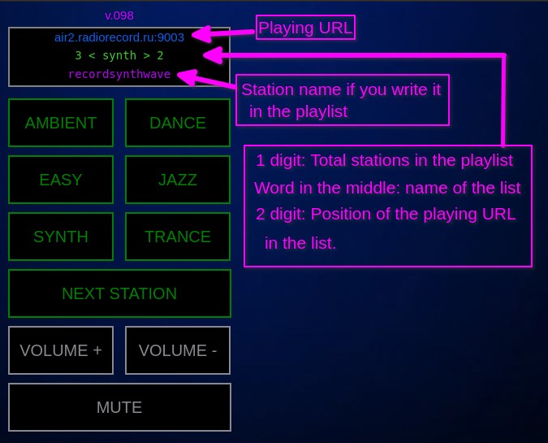

This is a simple player for i-radio stations.

The player after starting downloads playlists from github and buttons in the webUI will be named as downloaded playlists.

In order to use your own playlists add your repo address in RadioApplication.java (string 18)

The UI fits for sellphone (based on jsp):

All below is just for myself for using as embedded:

Install to Debian 10:

1. install minimum system
2. apt install xserver-xorg-video-all xserver-xorg-input-all xserver-xorg-core xinit x11-xserver-utils openssh-server alsa-utils nodm wicd openjdk-11-jre-headless
3. vi .bashrc
java -jar ...
4. Reduce time waiting bootloader:
- vi /etc/default/grub
- update-grub

--------
20210625 v 1.5
- Added function update playlists

20210624 v 1.4
- Bug fix with mute

20210623 v 1.3 
- Added AAC support

